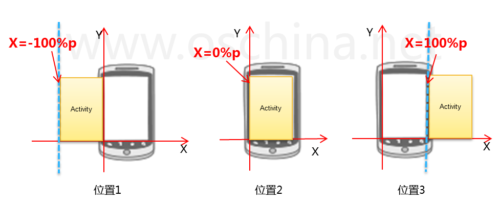

## fastjson 处理嵌套json对象
>fastjson 可以很方便的从 json 字符串解析数据，直接转换为 java class 对象  

### 非嵌套 json 字符串
直接使用 fastjson 提供的解析类方法，传入 json 字符串以及 class 类型，即可

### 嵌套 json 字符串
解析调用与非嵌套 json 解析一至，只是不同的地方在 class 定义上面

### 待成生对象 Class 定义
1. 所有待解析 类值域 须有公开访问权限。或者值域本身，或者是访问方法都可以
2. 所有待解析 类值域 名字须与 json 字符串中变量名字对应
3. 如第二条不能满足，则需要在 类值域 定义或者是访问方法前加入   @JSONField(name = "title")   指定 本值域在 json 字符串中对应的变量名
4. 若存在嵌套 json 对象，则 class 中嵌套子对象需要有无参的构造方法

## Activity 切换动画
Android Activity 之间切换时表现的动画设置方法

### 单次设置有效
在Android开发过程中，经常会碰到Activity之间的切换效果的问题，下面介绍一下如何实现左右滑动的切换效果，首先了解一下Activity切换的实现，从Android2.0开始在Activity增加了一个方法

    public void overridePendingTransition (int enterAnim, int exitAnim)

其中：

    enterAnim 定义Activity进入屏幕时的动画

    exitAnim 定义Activity退出屏幕时的动画

overridePendingTransition 方法必须在startActivity()或者 finish()方法的后面。

### 全局动画设置
#### 设置Activity 动画
我们可以在 AndroidManifest.xml 文件中，通过 android:theme 属性设置 Activity 的主题。主题中定义了关于 Activity 外观的很多特性。同时，主题中还可以定义 Activity 的切换动画。这是应用 Activity 切换动画的一种方法

定义包含动画的 Activity 主题

res/values/styles.xml，很简单，就是使用 windowAnimationStyle 这个属性，指定切换动画的style即可。

    

定义切换动画 style

res/values/styles.xml

    

注意需要继承自 @android:style/Animation.Activity。

#### 动画一些解释
首先我们先了解Activity的位置定义，如下图：
  
从上图可以看出，以手机屏幕下面边未X轴，屏幕左边为Y轴，当Activity在X轴值为-100%p时，刚好在屏幕的左边（位置1），当X轴值为0%p时，刚好再屏幕内(位置2），当X=100%p时刚好在屏幕右边（位置3）。

清楚了位置后，我们就可以实现左右滑动的切换效果，首先让要退出的Activity从位置2移动到位置1，同时让进入的Activity从位置3移动位置2，这样就能实现从左右切换效果。

实现过程如下，首先定义2个动画，在 res目录创建anim目录， 然后在目录创建动画的xml文件：out_to_left.xml (从左边退出动画) 、in_from_right.xml(从右边进入动画)  

    <?xml version="1.0" encoding="utf-8"?>
    <set xmlns:android="http://schemas.android.com/apk/res/android"  
        android:interpolator="@android:anim/accelerate_interpolator">
        <translate android:fromXDelta="100%p" android:toXDelta="0%p"
        android:duration="500" />
    </set>

## Activity 之间传递数据
### 传 Bundle
#### 接收端 接收 Bundle 数据
    Bundle myBundelForGetName=this.getIntent().getExtras(); 
    String name=myBundelForGetName.getString("Key_Name"); 